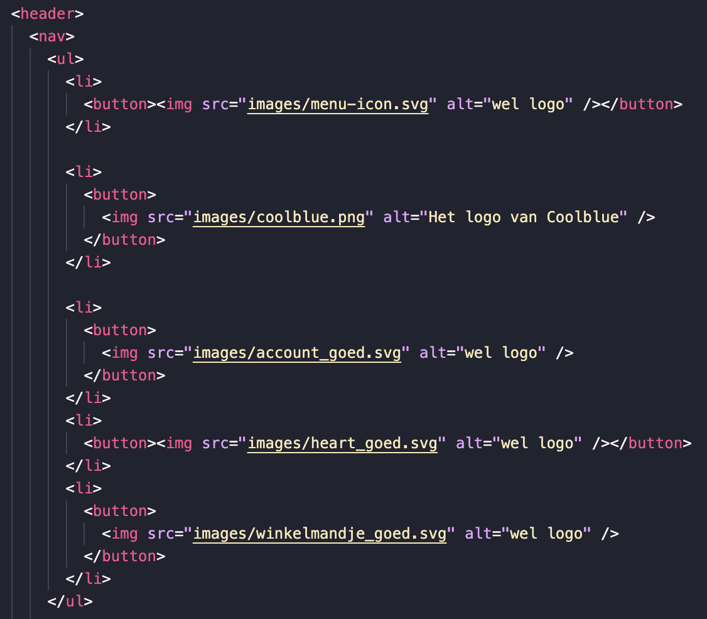

# Procesverslag

Markdown is een simpele manier om HTML te schrijven!  
Markdown cheat cheet: [Hulp bij het schrijven van Markdown](https://github.com/adam-p/markdown-here/wiki/Markdown-Cheatsheet).

Nb. De standaardstructuur en de spartaanse opmaak van de README.md zijn helemaal prima. Het gaat om de inhoud van je procesverslag. Besteedt de tijd voor pracht en praal aan je website.

Nb. Door _open_ toe te voegen aan een _details_ element kun je deze standaard open zetten. Fijn om dat steeds voor de relevante stuk(ken) te doen.

## Jij

  
uitwerken voor kick-off werkgroep

### Auteur:

Lanxiang Vermeulen

#### Je startniveau:

Blauw

#### Je focus:

Responsive

## Je website

  
uitwerken voor kick-off werkgroep

### Je opdracht:

https://www.coolblue.nl

#### Screenshot(s) van de eerste pagina (small screen):

Homepagina

#### Screenshot(s) van de tweede pagina (small screen):

Winkelmandje

## Toegankelijkheidstest 1/2 (week 1)

  
uitwerken na test in 2e werkgroep

### Bevindingen

Bevindingen screenreader
Alt-text niet duidelijk
De foto's zijn niet omschreven, er word niet duielijk omschreven wat je ziet.
Zo heb je op de homepagina allemaal sfeer foto's en als Alt-text staat er alleen een kopje van het artikel bij. Ook als je gaat naar specifieke producten word dit niet goed toegepast. Er wordt letter een soort product code als alt-tekst toegevoegd, maar verder omschrijven ze niet
duidelijk wat je ziet.

Reviews
Screenreader las wel op hoeveel reviews er waren gegeven op een bepaald product, maar er werd niet duidelijk vermeld wat de uitkomst daarvan was. Dus er word niet gezegd: "Dit product heeft 5 sterren, dit is gebaseerd op 5 reacties die zijn achtergelaten". Dit is vrij onhandig en onduidelijk voor mensen die alleen een screenreader gebruiken.

Text to speech leest niet alles voor
De text to speech slaat een volledige blok over omdaat Coolblue een afbeelding heeft geplaatst zonder Alt-text.
Het blok ging over werken bij Coolblue en vacatures. Ze hadden van de afbeelding een A gemaakt. Dus voor iemand met een screenreader is het onmogelijk om te weten waar opklikken.

Heel veel DIV

Bevindingen disability test
Tijdens de werkgroep hebben we ook aantal testen gedaan waarbij je kan ervaren hoe het is om ADHD, Slechtziend, Parkinson en een lichamelijke beperking. Het was erg interessant en belangrijk om zulke testen uit te voeren. Zo heb ik zelf getest hoe het is om met ADHD, slechtziendheid en een lichamelijke beperking door een website heen te navigeren. Normaal gesproken sta je helemaal niet stil bij dit soort disabilities dus het was hee lerg leerzaam om dit te ervaren. Hieronder heb ik aantal bevindingen uitgeschreven:

Bevindingen ADHD

- Opvallende dingen vallen op
- Erg lastig om een zinnen te lezen
- Heel veel moeite met concentratie
- Het kost meer energie om je gedachten erbij te houden

Bevindingen slechtziendheid

- Kleine letters zijn bijna niet te lezen
- Dingen die te dicht bij elkaar staan zijn lastig te onderscheiden
- Hele dunne lettertypes zijn niet te lezen
- Lichte kleuren zijn niet goed te zien

Bevindingen Lichamelijke beperking (Het missen van twee vingers)

- Teksten uittypen duurde wat langer
- Het is lastiger om sommige shortcuts te gebruiken op je laptop, denk aan CMD+P

Bevindingen WCAG Checklist

bevindingen Kleurenblind

Contrast checken & bevindingen

## Breakdownschets (week 1)

  
uitwerken na afloop 3e werkgroep

### Homepagina schetsen

  
    

### Winkelwagen schetsen

  
    

### Winkelwagen leeg:

  

### Hamburger menu:

  

### Carousel:

  

## Voortgang 1 (week 2)

  
uitwerken voor 1e voortgang

### Stand van zaken

Tijdens de tweede week kreeg ik voor het eerst te maken met Grid. Ik heb vorig jaar vooral veel les gehad over Flexbox, dus werken met grid was voor mij helemaal nieuw. Aangezien ik dit dus nooit had gedaan besloot ik de oefenopdrachten te doen en heb ik grid garden gemaakt zodat ik een beter begrip kreeg van de grid methode. Ik zeg het maar direct: I HATE GRID! Ik heb er erg veel moeite mee. Ik begrijp ongeveer wel hoe het werkt na de oefeningen, maar in praktijk is het echt irritant. Ik kan mij wel voorstellen dat dit misschien in de toekomst makkelijker gaat zijn. Maar helaas ben ik daar nog niet.

  
  

Ik begon met het maken van de header, de header is op beide pagina hetzelfde dus het leek mij handig om daarmee te beginnen. Eerlijk gezegd dacht ik dat het een makkelijk zou zijn maar de header was ook direct mijn grootste uitdaging. Ten eerste vond ik het lastig om te bepalen of flexbox of grid hiervoor geschikt was en had behoorlijke opstart problemen omdat ik even niet meer wist hoe alles werkt aangezien ik vorig jaar voor het laatst iets met codes had gedaan.

Ik kwam er algauw achter dat de coolblue website heel erg uitgebreid is. Om dit haalbaar te houden heb ik samen met de docent (Marten Paul Moolenaar) de website doorgenomen en samen besproken wat handig is om te maken. Elementen waar herhaling in zit mocht ik laten. Hierdoor kreeg ik wat meer overzicht en kon ik beter verder werken.

### Agenda voor meeting

Voorbereidende vragen

- Wanneer kan je het beste flexbox gebruiken? En wanneer grid?
- Is de structuur van mijn HTML semantisch?
- Oefeningen doen tijdens de werkgroepen, veel om feedback vragen

### Verslag van meeting

De meeting was erg fijn en heeft voor veel duidelijkheid gezorgd. Ik heb de oefeningen gedaan tijdens de werkgroep, ik kon direct om feedback vragen. Tijdens de werkgroep heb ik gewerkt aan de typografie, flexbox en grid oefening. Het was een fijn begin omdat ik hierdoor weer even kon wennen aan de codes en de werking daarvan. Na de oefening besloot ik om opnieuw te gaan kijken naar mijn navigatie. Voor de werkgroep was ik al zelf begonnen met de header, alleen dit had ik dus voor een laptop scherm gemaakt. Hierdoor moest ik even schakelen naar een mobielescherm want het is mobile first. Ik had door de werkgroep beslotem om mijn navigatie te gaan maken met flexbox. De rede hiervoor is dat de elementen geen vaste plek hebben/structuur hebben en het daardoor makkelijk te positioneren is met Flexbox.

Verder heb ik mijn structuur schetsen bekeken en vergeleken met mijn klasgenoten. Ondankt iedereen een andere website heeft was het toch even fijn om te zien wat anderen mensen hebben gemaakt.

Plan voor week 3
In de derde week ga ik mij vooral focussen op mijn website en wat minder op de oefenopdrachten. Ik merk dat ik daar te veel tijd aan besteed. Het is zeker handig om de opdrachten te maken, maar ze hoeven niet perfect of af. Mijn project wel dus vanaf nu ga ik aan de slag met mijn project en mocht ik ergens vastlopen kan ik de oefenopdrachten er altijd nog bij pakken.
Deze week heeft de content erin zetten vooral prioriteit zodat ik daar later verder mee kan bouwen.

## Voortgang 2 (week 3)

  
uitwerken voor 2e voortgang

Tijdens de derde week heb grootte stappen gemaakt. Mijn focus lag vooral op het plaatsen van content en vormgeven.
Het was een hele uitdaging en hieronder heb ik mijn bevindingen van de week uitgeschreven.

Homepagina

Section & Class
Tijdens het maken van de strutuur van de HTML kwam ik erachter dat het super verwarrend is om met alleen sections te werken. Ik had nog maar twee sections en het werd voor mij al super onduidelijk. Dus daarom had ik ervoor gekozen om tijdelijke classes aan te maken zodat ik sneller en makkelijker een bepaalde section kan aanspreken. Ook werkte ik niet op volgorde, dus was deze oplossing ideaal.

Li-tag & Aria label
Voor het maken van een zoekbalk heb je een input nodig, hierbij heb je een bijpassende tag. Ik had er eerst een Li tag omheen gezet omdat ik dacht dat dit een onderdeel was van de navigatie en het er dus een list item van gemaakt. Maar ik kwam erachter dat dit niet semantisch is om twee redenen:

1. Er moet altijd een UL omheen, dit had ik dus niet gedaan... echte schande!
2. Een form-tag is veel meer geschikt voor een input. Volgens NDM is een form-tag geschikt voor het versturen van data. Aangezien je in een input data intypt de geeft aan de server om iets te vinden, leek mij dus deze tag er meer geschikt voor
   

Verder heb ik ontdekt dat je bij een button een aria label kan zetten zodat screenreader extra informatie kan geven aan de gebruikers. Een aria-label verbeterd toegankelijkheid en zorgt voor duidelijke acties. Je weet beter wat te verwachten als je de knop indrukt.
Ik vind het erg leuk om meer bezig te zijn met toegankelijkheid van website, het is belangrijk om iets te maken waar iedereen gebruik van kan maken. Dit vak zorgt ervoor dat ik mij meer bewust ben van verschillende groepen mensen waar je rekening mee moet houden.

Carousel

categorien
Voor de categorieën heb ik ervoor gekozen om er alleen een UL-tag om de items heen te zetten en geen article omdat de links gaan naar nog een overzichtspagina en niet naar een soort detail pagina met aanvullende content.

studenten
Coolblue heeft voor de studenten een speciale deal. Toen ik eraan begon dacht ik dat wat ik had gedaan de beste oplossing was, maar ik kwam er algauw achter dat ik beter met Grid had kunnen werken. Maar doordat ik al zo ver was gekomen, heb ik ervoor gekozen om het op te lossen met een twee apparte sections waardoor het kopje boven de afbeelding komt te staan. Dit is zeker niet de meest elegante manier, maar gezien de tijd heb ik ervoor gekozen om te gaan focussen op de accessibility. Mocht ik nog meer tijd hebben zou ik dus het kopje, achtergrond foto en de content verdelen in een grid om het beter te positoneren.

Coolblue is illegal!
Tijdens het programmeren liep ik erg vast bij de product elementen. Want coolblue had twee verschillende linkejs. Als je op het product blokje klikt ga je naar de pagina met meer informatie over het product, maar als je op de reviews klikt ga je naar de review pagina. Maar de review link stond in een blokje die ook een link was, en ik begreep niet hoe ze dit hadden gedaan. Na wat uitzoek werk, kwam ik erachter dat ze een link in een link hadden gestopt. Dit wilde ik direcht namaken, Ik ging naar de NDM website om naar voorbeelden te zoeken, maar toen ik het ging googlelen kwam er al snel naar boven dat dit echt niet kan en alles behalve semantisch is. Dus hierdoor moest ik een andere oplossing zoeken. Mijn oplossing was om twee apparte A-tjes aan te maken in de een list-item.

Kom werken!
Het kom werken section is op de coolblue website niet gecodeerd maar het is een plaatje en het heeft geen alttext. Hierdoor kunnen mensen met een screenreader niet weten dat je dus kan solliciteren. Dit lijkt mij totaal niet vriendelijk, dus hierdoor heb ik ervoor gekozen om te programmeren.

Autorepeat
Tijdens de werkgroep vroeg de docent bij een element waarom ik geen autorepeat had gebruikt. Ik begreep niet helemaal wat hij bedoelde en kwam je een soort shortcuts heb met grid.

Winkelmandje
Grid (Winkelwagen)
productpolonaise
winkelmandmetcamera
flexbox/grid

hier dit ging goed & dit was lastig (neem ook screenshots op van delen van je website en code)

### Agenda voor meeting

- Ik had wat vragen over

### Verslag van meeting

Feedback/advies Brianne

- States - focus
- Active states / hover actives (vb checkbox)
- Alt text
- Aria-label
- Header toevoegen
- Kloppende hiërarchie

Plan voor week 3

## Toegankelijkheidstest 2/2 (week 4)

  
uitwerken na test in 9e werkgroep

### Bevindingen

- Input label
- section moet div worden als er geen header in zit
- Decorative fotos moeten een alt hebben (leeg)
- input/button focus toevoegen

Lijst met je bevindingen die in de test naar voren kwamen (geef ook aan wat er verbeterd is):

## Voortgang 3 (week 4)

  
uitwerken voor 3e voortgang

### Stand van zaken

- media queries
- hamburger menu / responsive
- Winkelmand
-

hier dit ging goed & dit was lastig (neem ook screenshots op van delen van je website en code)

### Agenda voor meeting

samen met je groepje opstellen

| student 1      | student 2          | student 3    | student 4        |
| -------------- | ------------------ | ------------ | ---------------- |
| dit bespreken  | en dit             | en ik dit    | en dan ik dat    |
| en dat ook nog | dit als er tijd is | nog een punt | dit wil ik zeker |
| ...            | ...                | ...          | ...              |

### Verslag van meeting

hier na afloop snel de uitkomsten van de meeting vastleggen

- punt 1
- punt 2
- nog een punt
- ...

## Eindgesprek (week 5)

  
uitwerken voor eindgesprek

### Je uitkomst - karakteristiek screenshots:

  

### Dit ging goed/Heb ik geleerd:

Korte omschrijving met plaatjes

  

### Dit was lastig/Is niet gelukt:

Korte omschrijving met plaatjes

  

## Bronnenlijst

  
continu bijhouden terwijl je werkt

Nb. Wees specifiek ('css-tricks' als bron is bijv. niet specifiek genoeg).
Nb. ChatGpT en andere AI horen er ook bij.
Nb. Vermeld de bronnen ook in je code.

1. bron 1
2. bron 2
3. ...

