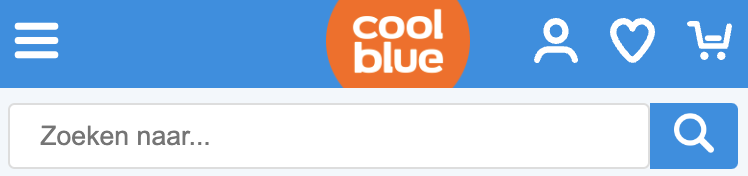
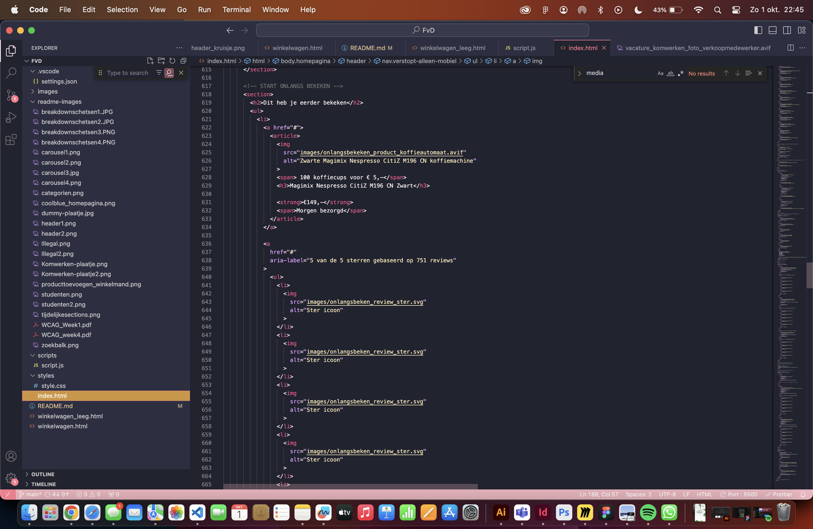
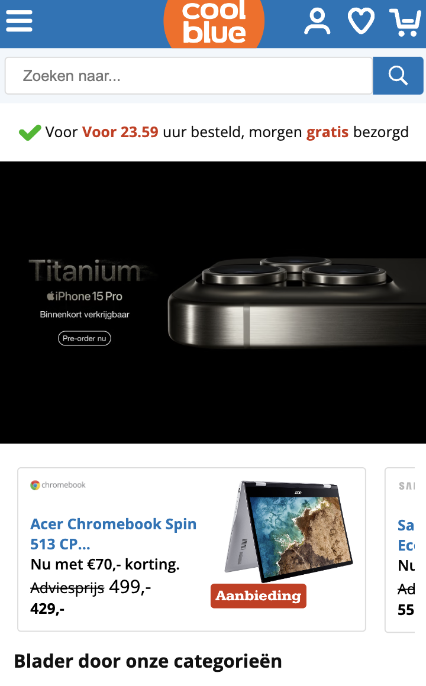
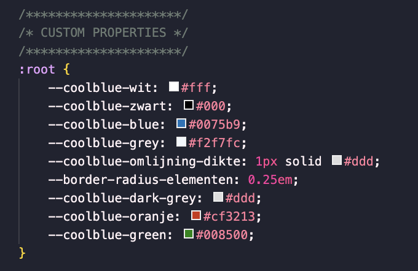
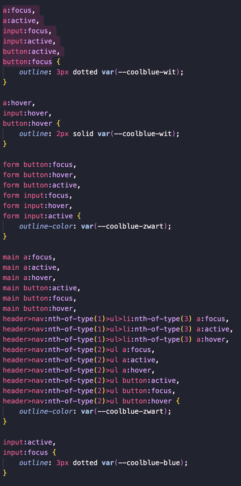
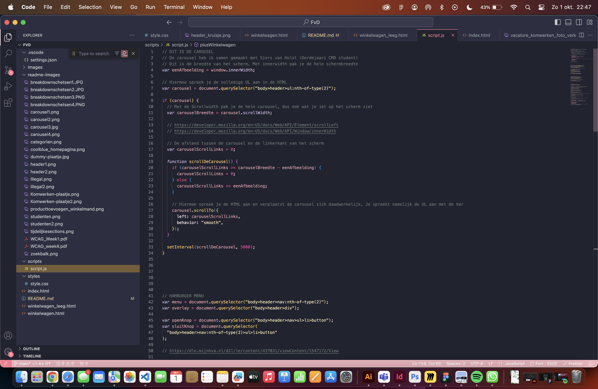
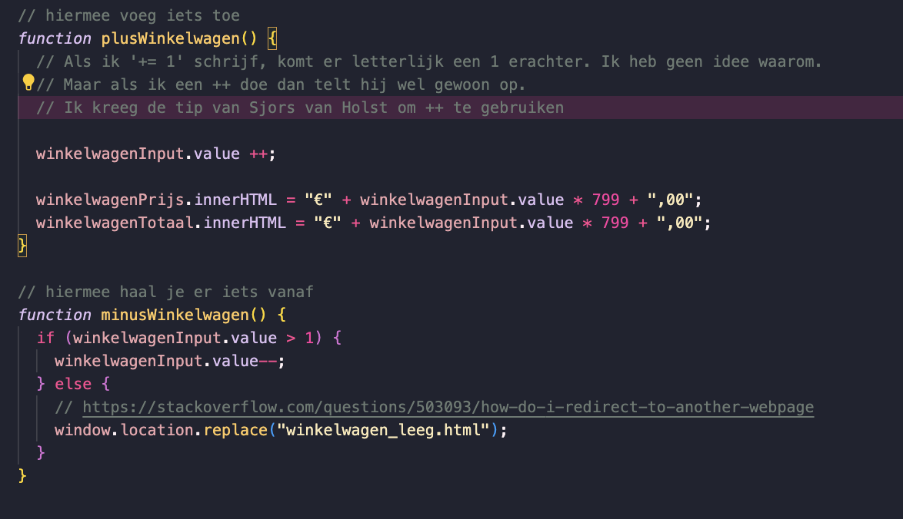
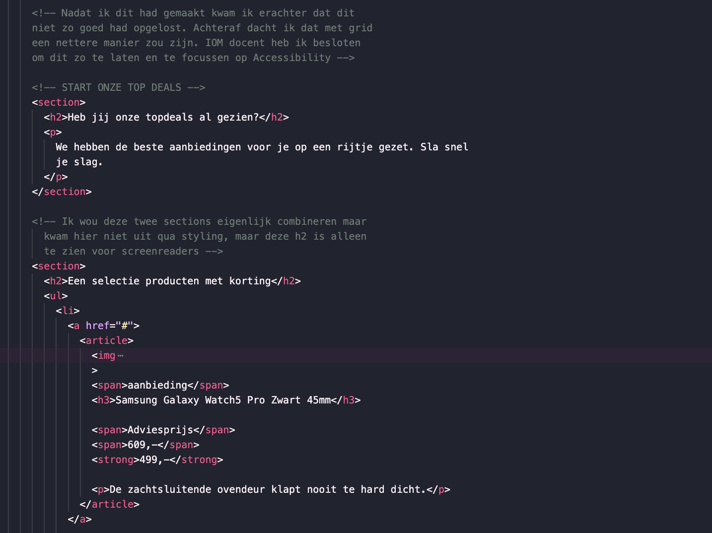

# Procesverslag

Markdown is een simpele manier om HTML te schrijven!  
Markdown cheat cheet: [Hulp bij het schrijven van Markdown](https://github.com/adam-p/markdown-here/wiki/Markdown-Cheatsheet).

Nb. De standaardstructuur en de spartaanse opmaak van de README.md zijn helemaal prima. Het gaat om de inhoud van je procesverslag. Besteedt de tijd voor pracht en praal aan je website.

Nb. Door _open_ toe te voegen aan een _details_ element kun je deze standaard open zetten. Fijn om dat steeds voor de relevante stuk(ken) te doen.

## Jij

  
uitwerken voor kick-off werkgroep

### Auteur:

Lanxiang Vermeulen

#### Je startniveau:

Blauw

#### Je focus:

Responsive

## Je website

  
uitwerken voor kick-off werkgroep

### Je opdracht:

https://www.coolblue.nl

#### Screenshot(s) van de eerste pagina (small screen):

Homepagina

#### Screenshot(s) van de tweede pagina (small screen):

Winkelmandje

## Toegankelijkheidstest 1/2 (week 1)

  
uitwerken na test in 2e werkgroep

### Bevindingen

Bevindingen screenreader
Alt-text niet duidelijk
De foto's zijn niet omschreven, er word niet duielijk omschreven wat je ziet.
Zo heb je op de homepagina allemaal sfeer foto's en als Alt-text staat er alleen een kopje van het artikel bij. Ook als je gaat naar specifieke producten word dit niet goed toegepast. Er wordt letter een soort product code als alt-tekst toegevoegd, maar verder omschrijven ze niet
duidelijk wat je ziet.

Reviews
Screenreader las wel op hoeveel reviews er waren gegeven op een bepaald product, maar er werd niet duidelijk vermeld wat de uitkomst daarvan was. Dus er word niet gezegd: "Dit product heeft 5 sterren, dit is gebaseerd op 5 reacties die zijn achtergelaten". Dit is vrij onhandig en onduidelijk voor mensen die alleen een screenreader gebruiken.

Text to speech leest niet alles voor
De text to speech slaat een volledige blok over omdaat Coolblue een afbeelding heeft geplaatst zonder Alt-text.
Het blok ging over werken bij Coolblue en vacatures. Ze hadden van de afbeelding een A gemaakt. Dus voor iemand met een screenreader is het onmogelijk om te weten waar opklikken.

Bevindingen disability test
Tijdens de werkgroep hebben we ook aantal testen gedaan waarbij je kan ervaren hoe het is om ADHD, Slechtziend, Parkinson en een lichamelijke beperking. Het was erg interessant en belangrijk om zulke testen uit te voeren. Zo heb ik zelf getest hoe het is om met ADHD, slechtziendheid en een lichamelijke beperking door een website heen te navigeren. Normaal gesproken sta je helemaal niet stil bij dit soort disabilities dus het was hee lerg leerzaam om dit te ervaren. Hieronder heb ik aantal bevindingen uitgeschreven:

Bevindingen ADHD
- Opvallende dingen vallen op
- Erg lastig om een zinnen te lezen
- Heel veel moeite met concentratie
- Het kost meer energie om je gedachten erbij te houden

Bevindingen slechtziendheid
- Kleine letters zijn bijna niet te lezen
- Dingen die te dicht bij elkaar staan zijn lastig te onderscheiden
- Hele dunne lettertypes zijn niet te lezen
- Lichte kleuren zijn niet goed te zien

Bevindingen Lichamelijke beperking (Het missen van twee vingers)
- Teksten uittypen duurde wat langer
- Het is lastiger om sommige shortcuts te gebruiken op je laptop, denk aan CMD+P

WCAG Checklist
<a href="/readme-images/WCAG_Week1.pdf"> WCAG Checklist </a>
Ik vind Coolblue een super leuke winkel en had ook verwacht dat ze super accessible zouden zijn. Maar samen met Jade kwamen we erachter dat het best wel tegenviel. 
Hieronder heb ik mijn bevindingen uitgeschreven: 
- Veel kleuren die ze gebruikte waren niet vriendelijk voor mensen die bijvoorbeeld kleurenblind zijn. Zelfs hun blauwe hoofdthema kleur was niet goed.
- Sommige buttons bevatten geen Aria-Label of zijn vaag omschreven. Dit geld ook ook voor foto's. Ze bevatten nietszeggende Alt-teksten. 
- Ze hebben een H1 en H2, maar de kopjes van de producten zelf staan in een span (op de homepagina)
- Je kan niet inzoomen
- Ze hebben bij veel elementen foto's gebruikt waarop hele belangrijke content staat, hierdoor kan je als gebruiker niet echt door alle content heen gaan 

## Breakdownschets (week 1)

  
uitwerken na afloop 3e werkgroep

### Homepagina schetsen

  
    

### Winkelwagen schetsen

  
    

## Voortgang 1 (week 2)

  
uitwerken voor 1e voortgang

### Stand van zaken

Tijdens de tweede week kreeg ik voor het eerst te maken met Grid. Ik heb vorig jaar vooral veel les gehad over Flexbox, dus werken met grid was voor mij helemaal nieuw. Aangezien ik dit dus nooit had gedaan besloot ik de oefenopdrachten te doen en heb ik grid garden gemaakt zodat ik een beter begrip kreeg van de grid methode. Ik zeg het maar direct: I HATE GRID! Ik heb er erg veel moeite mee. Ik begrijp ongeveer wel hoe het werkt na de oefeningen, maar in praktijk is het echt irritant. Ik kan mij wel voorstellen dat dit misschien in de toekomst makkelijker gaat zijn. Maar helaas ben ik daar nog niet.

  
  
  

Ik begon met het maken van de header, de header is op beide pagina hetzelfde dus het leek mij handig om daarmee te beginnen. Eerlijk gezegd dacht ik dat het een makkelijk zou zijn maar de header was ook direct mijn grootste uitdaging. Ten eerste vond ik het lastig om te bepalen of flexbox of grid hiervoor geschikt was en had behoorlijke opstart problemen omdat ik even niet meer wist hoe alles werkt aangezien ik vorig jaar voor het laatst iets met codes had gedaan.

Ik kwam er algauw achter dat de coolblue website heel erg uitgebreid is. Om dit haalbaar te houden heb ik samen met de docent (Marten Paul Moolenaar) de website doorgenomen en samen besproken wat handig is om te maken. Elementen waar herhaling in zit mocht ik laten. Hierdoor kreeg ik wat meer overzicht en kon ik beter verder werken.

### Agenda voor meeting

Voorbereidende vragen
- Wanneer kan je het beste flexbox gebruiken? En wanneer grid?
- Is de structuur van mijn HTML semantisch?
- Oefeningen doen tijdens de werkgroepen, veel om feedback vragen

### Verslag van meeting

De meeting was erg fijn en heeft voor veel duidelijkheid gezorgd. Ik heb de oefeningen gedaan tijdens de werkgroep, ik kon direct om feedback vragen. Tijdens de werkgroep heb ik gewerkt aan de typografie, flexbox en grid oefening. Het was een fijn begin omdat ik hierdoor weer even kon wennen aan de codes en de werking daarvan. Na de oefening besloot ik om opnieuw te gaan kijken naar mijn navigatie. Voor de werkgroep was ik al zelf begonnen met de header, alleen dit had ik dus voor een laptop scherm gemaakt. Hierdoor moest ik even schakelen naar een mobielescherm want het is mobile first. Ik had door de werkgroep beslotem om mijn navigatie te gaan maken met flexbox. De rede hiervoor is dat de elementen geen vaste plek hebben/structuur hebben en het daardoor makkelijk te positioneren is met Flexbox.

Verder heb ik mijn structuur schetsen bekeken en vergeleken met mijn klasgenoten. Ondankt iedereen een andere website heeft was het toch even fijn om te zien wat anderen mensen hebben gemaakt.

Plan voor week 3
In de derde week ga ik mij vooral focussen op mijn website en wat minder op de oefenopdrachten. Ik merk dat ik daar te veel tijd aan besteed. Het is zeker handig om de opdrachten te maken, maar ze hoeven niet perfect of af. Mijn project wel dus vanaf nu ga ik aan de slag met mijn project en mocht ik ergens vastlopen kan ik de oefenopdrachten er altijd nog bij pakken.
Deze week heeft de content erin zetten vooral prioriteit zodat ik daar later verder mee kan bouwen.

## Voortgang 2 (week 3)

  
uitwerken voor 2e voortgang

Tijdens de derde week heb grootte stappen gemaakt. Mijn focus lag vooral op het plaatsen van content en vormgeven.
Het was een hele uitdaging en hieronder heb ik mijn bevindingen van de week uitgeschreven.

Homepagina

Section & Class
Tijdens het maken van de strutuur van de HTML kwam ik erachter dat het super verwarrend is om met alleen sections te werken. Ik had nog maar twee sections en het werd voor mij al super onduidelijk. Dus daarom had ik ervoor gekozen om tijdelijke classes aan te maken zodat ik sneller en makkelijker een bepaalde section kan aanspreken. Ook werkte ik niet op volgorde, dus was deze oplossing ideaal.

Li-tag & Aria label
Voor het maken van een zoekbalk heb je een input nodig, hierbij heb je een bijpassende tag. Ik had er eerst een Li tag omheen gezet omdat ik dacht dat dit een onderdeel was van de navigatie en het er dus een list item van gemaakt. Maar ik kwam erachter dat dit niet semantisch is om twee redenen:

1. Er moet altijd een UL omheen, dit had ik dus niet gedaan... echte schande!
2. Een form-tag is meer geschikt voor een input. Volgens NDM is een form-tag geschikt voor het versturen van data. Aangezien je in een input data intypt de geeft aan de server om iets te vinden, leek mij dus deze tag er meer geschikt voor
   

Verder heb ik ontdekt dat je bij een button een aria label kan zetten zodat screenreader extra informatie kan geven aan de gebruikers. Een aria-label verbeterd toegankelijkheid en zorgt voor duidelijke acties. Je weet beter wat te verwachten als je de knop indrukt.
Ik vind het erg leuk om meer bezig te zijn met toegankelijkheid van website, het is belangrijk om iets te maken waar iedereen gebruik van kan maken. Dit vak zorgt ervoor dat ik mij meer bewust ben van verschillende groepen mensen waar je rekening mee moet houden.

categorien
Voor de categorieën heb ik ervoor gekozen om er alleen een UL-tag om de items heen te zetten en geen article omdat de links gaan naar nog een overzichtspagina en niet naar een soort detail pagina met aanvullende content.

studenten
Coolblue heeft voor de studenten een speciale deal. Toen ik eraan begon dacht ik dat wat ik had gedaan de beste oplossing was, maar ik kwam er algauw achter dat ik beter met Grid had kunnen werken. Maar doordat ik al zo ver was gekomen, heb ik ervoor gekozen om het op te lossen met een twee apparte sections waardoor het kopje boven de afbeelding komt te staan. Dit is zeker niet de meest elegante manier, maar gezien de tijd heb ik ervoor gekozen om te gaan focussen op de accessibility. Mocht ik nog meer tijd hebben zou ik dus het kopje, achtergrond foto en de content verdelen in een grid om het beter te positoneren.

Coolblue is illegal!
Tijdens het programmeren liep ik erg vast bij de product elementen. Want coolblue had twee verschillende linkejs. Als je op het product blokje klikt ga je naar de pagina met meer informatie over het product, maar als je op de reviews klikt ga je naar de review pagina. Maar de review link stond in een blokje die ook een link was, en ik begreep niet hoe ze dit hadden gedaan. Na wat uitzoek werk, kwam ik erachter dat ze een link in een link hadden gestopt. Dit wilde ik direcht namaken, Ik ging naar de NDM website om naar voorbeelden te zoeken, maar toen ik het ging googlelen kwam er al snel naar boven dat dit echt niet kan en alles behalve semantisch is. Dus hierdoor moest ik een andere oplossing zoeken. Mijn oplossing was om twee apparte A-tjes aan te maken in de een list-item.

Kom werken!
Het kom werken section is op de coolblue website niet gecodeerd maar het is een plaatje en het heeft geen alttext. Hierdoor kunnen mensen met een screenreader niet weten dat je dus kan solliciteren. Dit lijkt mij totaal niet vriendelijk, dus hierdoor heb ik ervoor gekozen om te programmeren.

Autorepeat
Tijdens de werkgroep vroeg de docent bij een element waarom ik geen autorepeat had gebruikt. Ik begreep niet helemaal wat hij bedoelde. 
Dus ik heb met een studentassistent opgezocht hoe het werkte. En uiteindelijk is mij ook gelukt om het te gebruiken in mijn code. 
Ik vond het echt handig en ben het op plekken gaan gebruiken. 

Moeite met de carousel 
Ik wilde graag proberen om de carousel te maken. Het is mij gelukt met hulp! Maar ik vind het begrijpen van die code erg lastig. 
Daarom besloot om het op papier uit te tekenen zodat ik beter begrijp wat er nou precies gebeurd. 
Nu heb ik dit een aantal keer uitgelegd gekregen en vind het nog steeds best lastig. Ik wilde hem eigenlijk ook eraf halen aangezien ik de code niet goed begrijp. 
Maar ik heb uiteindelijk toch besloten om het erop te houden omdat de website voor mijn gevoel af is en op deze manier toch een mooie site kan opleveren. Ik heb geprobeerd om 
de codes beter begrijpbaar voor mezelf te maken door extra veel comments bij te zetten. 

### Agenda voor meeting
Voorbereidende vragen
- Wat kan ik doen om mijn accessibility te optimaliseren?
- Klopt de stuctuur van mijn website nog steeds?

### Verslag van meeting
Ik had aan het einde van de week een feedback gesprek gehad met een student assistente genaamd Brianne. Wij hebben samen naar mijn codes en readme gekeken. 
Als eerst kreeg ik het advies om echt mijn readme bij te houden. Spoiler... het was mij niet helemaal gelukt. Ik kreeg wel de tip om steekwoorden en kleine zinnen neer te zetten zodat ik niet vergeet wat er per week gebeurd is. En aangezien ik vaak dingen uitstel, leek mij dit wel echt een hele goede tip. Dus na het gesprek had ik direct alle besproken onderdelen in steekwoorden opgeschreven. 

Brianne en ik hebben de volgende dingen besproken: 
- Mijn codes zien er goed uit op het gebied van content, vanaf nu moet ik mij ook wat meer gaan focussen op accessibility, dus denk aan active states, hover states en focus states
- Een goede ALT-text, op veel plekken stond er nog geen correcte ALT-tekst.
- Bij de buttons staan er nog geen aria-labels. Echt belangrijk om te doen voor je gebruiker
- Ik heb nog geen H1
  
Plan voor week 4
De content staat. De aankomende week ga ik focussen op het responsive maken van mijn site en ik ga proberen wat kleine micro-actions toe te voegen aan de site. 
Om eerlijk te zijn strok ik erg van de moeilijkheidsgraad van de carousel waardoor ik eigenlijk niets meer met Javascript wilde doen. Misschien was het niet zo handig om met de carousel te beginnen. Maar ik ga het toch proberen en hopelijk zijn de andere elementen wat makkelijker te schrijven en begrijpen :) 

To lijst (dit moet wel echt werken): 
- Responsive maken van mijn site met media queries
- Hamburgermenu werkend maken
- Winkelmand werkend maken

To do lijst (Leuk als het werkt:
- Footer met nieuwsbrief aanmelden
- Kleine verrassing in de code voor de docent
- De zoekfunctie werkend maken zoals op coolblue

## Toegankelijkheidstest 2/2 (week 4)

  
uitwerken na test in 9e werkgroep

### Bevindingen
<a href="/readme-images/WCAG_week4"> WCAG Checklist </a>
In de vierde week ging ik samen met Charlotte de WCAG lijst doornemen en checken of mijn website volgens de hun regels is gemaakt. 
Ik had al snel door dat ik heel veel dingen nog niet goed erin had gezet. Ik heb hiervan een lijst gemaakt en toegevoegd aan mijn to do lijst. 

Dit zijn de punten die ik heb verbeterd (dit heb ik op een later moment gedaan) 
- Ik heb duidelijke input en buttons geschreven  
- Een section moet DIV worden als er geen header inzit 
- Decorative fotos moeten een alt hebben, je mag het eventueel leeg laten
- Kleur contrast was nog niet goed, dit heb aangepast
- Er miste op bepaalde plekken nog aria labels 
- Eén header per pagina, ik had nog geen header...

Chat GPT checkt mijn code 
Ik heb ook aan chatGPT gevraagd of er nog extra dingen zijn die ik kan doen om mijn code te optimaliseren. En chatGPT heeft zeker wat goede suggesties gegeven die ik heb toegevoegd. 
De volgende dingen heb ik aangepast door ChatGPT: 
- Alt text verbeterd, foto's nog specifier omschreven
- Arialabel kan je ook toevoegen op de navigatie en forms. Zo is voor bezoekers nog toegankelijker.

Wave checker 
Wave is een website die je code checked of ze toegankelijk genoeg zijn en of er nog dingen aangepast moet worden. Ik kreeg wel een aantal melding, vooral op het gebied van kleur/contrast en font grootte. De volgende dingen heb ik aangepast: 
- Font groote, op sommige plekken was mijn font slecht leesbaar. Deze heb ik aangepast naar een grotere en dikkere font
- Kleuren contrast was op sommige plekken niet goed, vooral lichtblauw en lichtoranje kreeg veel meldingen
- Op sommige plekken was mijn alt-text te lang. Ik heb dit aangepast naar een wat kortere tekst.

## Voortgang 3 (week 4)

  
uitwerken voor 3e voortgang

### Stand van zaken 
Ik heb deze week als erg pittig ervaren. Ik heb een hele inhaalslag moeten doen omdat ik te lang ben blijven hangen in het goed plaatsen van de content dat ik een beetje in tijdnood kwam. Maar het is mij uiteindelijk wel gelukt om wat moois neer te zetten, maar niet zonder slag of stoot. Hieronder heb ik mijn lastigste obstakels uitgeschreven, vooral voormezef zodat ik het beter begrijp. 

Hamburgermenu werkend en responsive 
Ik heb de hamburger met javascript werkend kunnen maken. Hieronder heb ik een uitleg voor mezelf gemaakt zodat ik het beter begrijp. Dit is geschreven met hulp van chatGPT. Zo begrijp ik zelf beter wat er gebeurd: 
In het hamburger menu staat een lijst met pagina's die standaard de klasse ”verstopt-alleen-mobiel” hebben. Deze klasse zorgt ervoor dat de menu-items op mobiele apparaten verborgen zijn, terwijl ze op een desktop wel zichtbaar blijven. Dit komt doordat het menu op een desktop standaard altijd zichtbaar is, maar op mobiel alleen wanneer het hamburgermenu is geopend.
Wanneer je op het hamburger-icoontje tikt, wordt de klasse ”verstopt-alleen-mobiel” verwijderd, waardoor de menu-items op mobiel zichtbaar worden. Als je vervolgens op het sluit-icoontje van het hamburgermenu tikt, wordt de klasse ”verstopt-alleen-mobiel” opnieuw toegevoegd, waardoor de items weer verborgen worden.

Ik heb tijdens mijn vorige project een hamburger menu gemaakt, dus dit ging opzich wel soepel met javascript. 
Met een EventListener en een variabel was dit erg goed te doen. Alleen ik raakte erg in de waar omdat ik de hamburgermenu ook responsive wilde maken en het daar ineens heel anders werd. Ik kon niet alleen display:none doen omdat de hamburger menu op laptop openklapt, maar zoals je eerder hebt gelezen heb ik dit opgelost om in de media quaries een andere stijling te geven. 

Uitleg toggle functie (geschreven met ChatGPT) 
Er is één knop om de dropdown "Bekijk hele assortiment" te openen. We gebruiken JavaScript om te detecteren wanneer iemand op deze knop drukt. Als dat gebeurt, roepen we een functie aan die de klasse toggle gebruikt om de klasse ”verstopt-alles” toe te voegen of te verwijderen.
Als de dropdown-lijst al de class ”verstopt-alles” heeft, wordt deze verwijderd. Als de class er nog niet is, wordt deze toegevoegd. Op deze manier wisselt de dropdown tussen het wel of niet hebben van de class, oftewel hij "toggled” tussen de twee staten. 

De toggle functie was opzich goed te begrijpen en achteraf bedacht ik mij dat de toggle ook kon toepassen op het hamburger menu. Maar ik heb uiteindelijk toch voor gekozen om het zo te laten. 

Uitleg winkelmand (geschreven met ChatGPT)
In de winkelwagen hebben we verschillende elementen: een minknop, een plusknop, een invoerveld voor het aantal producten, de productprijs en de totale prijs van de bestelling. Als de gebruiker drukt op de plus knop  wordt de functie ‘plusWinkelwagen’ aangeroepen. Deze functie verhoogt het aantal producten in het invoerveld met 1, wat gedaan wordt via “winkelwagenInput.value++”. Vervolgens wordt de productprijs en de totale bestelprijs bijgewerkt. Dit gebeurt door het aantal producten te vermenigvuldigen met de productprijs. Tot slot wordt er een euroteken en “,00” toegevoegd voor een nette weergave. Als de gebruiker drukt op de min knop, roepen we ’minusWinkelwagen’ aan. Deze functie kijkt eerst of het aantal producten meer dan 1 is. Is dat het geval, dan vermindert het aantal met 1. Maar als er slechts 1 product over is en je drukt nogmaals op de minknop, dan wordt je naar de pagina winkelwagen_leeg.html gestuurd, omdat een winkelwagen niet leeg mag zijn.

Het is gelukt! Maar het process om dit te maken was niet leuk. Ik vond het best complex omdat ik meerdere elementen wilden laten werken. Maar chatGPT heeft mij goed geholpen met het begrijpen van de code. In het begin kwam ik er echt niet uit, maar uiteindelijk is het mij toch gelukt om het werkend te krijgen en ik kan het zelfds uitleggen! 

## Eindgesprek (week 5)

  
uitwerken voor eindgesprek

### Je uitkomst - karakteristiek screenshots:

### Dit ging goed/Heb ik geleerd:
- HTML stuctuur is als heet goed is helemaal semantisch en toegankelijk, ik heb er extra tijd aan besteed. Voor mij is het belangrijk dat mijn pagina toegankelijk is voor iedereen

- Mijn website is responsive! Ik ben hier echt mega trots op!! Het was vooral in mijn css nogal puzzelen omdat het bestand nog langer word door media quaries, maar het was echt mega leuk toen alles begon te werken

Werken met ROOT was ook echt heel fijn! Aan het einde wilde ik de coolblue kleuren aanpassen en dat ging zo gemakkelijk! Dus dat was super nice! 

Het toevoegen van een focus en active state ging ook erg goed. Ik vond het ook erg leuk om te ontdekken wat je allemaal hebt. Zo heb ik ook een hover toegevoegd om zo de toegankelijkheid te verbeteren

### Dit was lastig/Is niet gelukt:

- Ik vond alles met javascript super lastig en hierdoor wel wat minder leuk om te doen. Ik heb eigenlijk bij elk javascript onderdeeld hulp gehad. En nog steeds vind ik het vrij lastig om het te begrijpen.

-Vanwege de tijd kon ik niet een footer maken met inschrijven voor een nieuwsbrief

- In de winkelwagen kan je alleen optellen, niet aftrekken. Ik wist even niet meer hoe ik dat snel kon oplossen

- Het behouden van een opgeruimd bestand, dit vond ik oprecht lastig. Op een gegeven moment had ik 1000+ lijnen css, en had ik geen overzicht meer. Het heeft mij een halve dag gekost om dit allemaal op te ruimen.

Bij een element in mijn code wilde ik het graag herschrijven omdat mijn structuur niet goed was. Mijn doel was om dit te doen nadat de toegankelijkheid van mijn site verbeterd was. Maar dit heeft veel meer tijd gekost dan verwacht. Hierdoor heb ik dit niet kunnen verbeteren. 

## Bronnenlijst
1. https://stackoverflow.com/questions/24453148/style-radio-buttons-with-css3-before-and-after
2. https://chat.openai.com/share/c1eef304-c742-4a39-a375-3a132fed9ab1
3. https://chat.openai.com/share/d615e309-d1f0-4de2-a9f5-75fc0264c3c2
4. https://chat.openai.com/share/a5ff3b37-6bcf-4918-8bc3-d69d2cb005b0
5. https://wave.webaim.org/
6. https://developer.mozilla.org/en-US/docs/Web/HTML/Element/nav
7. https://developer.mozilla.org/en-US/docs/Web/API/Element/scrollLeft
8. https://developer.mozilla.org/en-US/docs/Web/API/Window/innerWidth
9. https://dlo.mijnhva.nl/d2l/le/content/437031/viewContent/1547172/View
10. https://stackoverflow.com/questions/503093/how-do-i-redirect-to-another-webpage
11. https://laracasts.com/discuss/channels/javascript/how-to-when-click-a-button-add-a-number-using-javascript
12. https://codepen.io/Sepehr-code/pen/oNegxKm
13. https://www.svgrepo.com/svg/80156/down-arrow
14. https://developer.mozilla.org/en-US/docs/Web/HTML/Element/form
15. https://developer.mozilla.org/en-US/docs/Web/HTML/Element/li
16. https://developer.mozilla.org/en-US/docs/Web/Accessibility/ARIA/Attributes/aria-label
17. https://icons8.com/icons/set/search
18. https://developer.mozilla.org/en-US/docs/Web/HTML/Element/nav
19. https://www.svgrepo.com/svg/80156/down-arrow
20. https://developer.mozilla.org/en-US/docs/Web/HTML/Element/menu
21. https://developer.mozilla.org/en-US/docs/Web/HTML/Element/input/radio
22. https://stackoverflow.com/questions/16670931/hide-scroll-bar-but-while-still-being-able-to-scroll
23. https://webaim.org/techniques/css/invisiblecontent/
24. https://stackoverflow.com/questions/32206116/position-absolute-left50-does-not-position-span-in-the-middle
25. https://stackoverflow.com/questions/57661659/w3c-css-validation-parse-error-on-variables
26. https://stackoverflow.com/questions/8684917/is-it-bad-practice-to-use-negative-margins-or-padding-in-css
27. https://css-tricks.com/practical-css-scroll-snapping
28. https://stackoverflow.com/questions/4148499/how-to-style-a-checkbox-using-css
29. https://markheath.net/post/customize-radio-button-css
30. https://developer.mozilla.org/en-US/docs/Web/CSS/::after
31. https://stackoverflow.com/questions/24453148/style-radio-buttons-with-css3-before-and-after
32. https://developer.mozilla.org/en-US/docs/Web/CSS/outline-offset
33. https://www.youtube.com/watch?v=8QKOaTYvYUA
34. https://developer.mozilla.org/en-US/docs/Web/CSS/CSS_media_queries/Using_media_queries
35. https://cssgridgarden.com/#nl
36. https://developer.mozilla.org/en-US/docs/Learn/HTML/Introduction_to_HTML/Document_and_website_structure
37. https://www.w3.org/WAI/standards-guidelines/wcag/
38. https://webaim.org/resources/contrastchecker/
39. https://coolors.co/contrast-checker/112a46-acc8e5
40. https://css-tricks.com/snippets/css/complete-guide-grid/
41. https://css-tricks.com/almanac/properties/g/grid-template-columns/
42. https://css-tricks.com/snippets/css/a-guide-to-flexbox/

Menselijke bronnen: 
1. Brianne (Klassen assistente)
2. Marten Paul Moolenaar
3. Sjors Van Holst
Verder heb ik ook nog hulp gehad van twee andere klassen assistenten, waarvan ik de namen helaas niet meer weet. 

  
continu bijhouden terwijl je werkt

